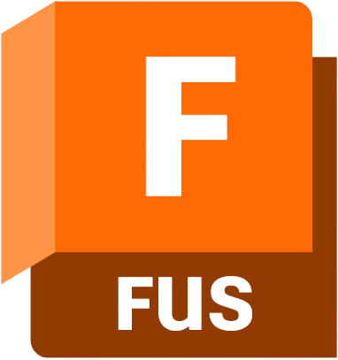
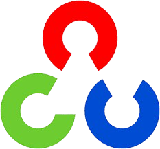
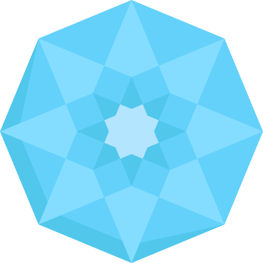

  
  <h1 class="typing-animation" align="center" >
    Hi, guys! I am Tiago Bryan! [369]
  </h1>
   

   <a href="https://github.com/TiagoBryan">
   
   

  <h1>Linguagens</h1>
  
  
  
  
  
   
   
  
   
  
  

 

  <h1>FrameWorks</h1>
   
  
  
  
  

 

  <h1>Ferramentas</h1>
   
  
  
  
  
  

  
  
  
  
  
  
  
  
  

 

  
  

  
Créditos: <a href="https://github.com/anuraghazra/github-readme-stats">Anurag Hazra</a> e <a href="https://github.com/rafaballerini">Rafaella Ballerini</a>

